# 1. 比赛数据与介绍

📖比赛将提供知乎的问题信息、用户画像、用户回答记录，以及用户接受邀请的记录，要求选手预测这个用户是否会接受某个新问题的邀请。

     1、问题信息。包括<问题id、问题创建时间、问题的话题、问题的文本、问题的描述>等。

     2、用户的回答。包括<回答id、问题id、作者id、回答的文本、回答时间、点赞数、收藏数、感谢数、评论数>等。

     3、用户人画像数据。包括<用户id、性别、活跃频次、关注话题、长期兴趣、盐值>等。

     4、<topic、token(词)、单字 64维 embedding >数据。

     5、最近一月的邀请数据包括<问题id、用户id、邀请时间、是否回答>。
     
🔗比赛详情链接：[智源 - 看山杯 专家发现算法大赛 2019](https://www.biendata.com/competition/zhihu2019/)

# 2. 比赛思路
## 2.1 鱼佬在竞赛讲座中的经验分享

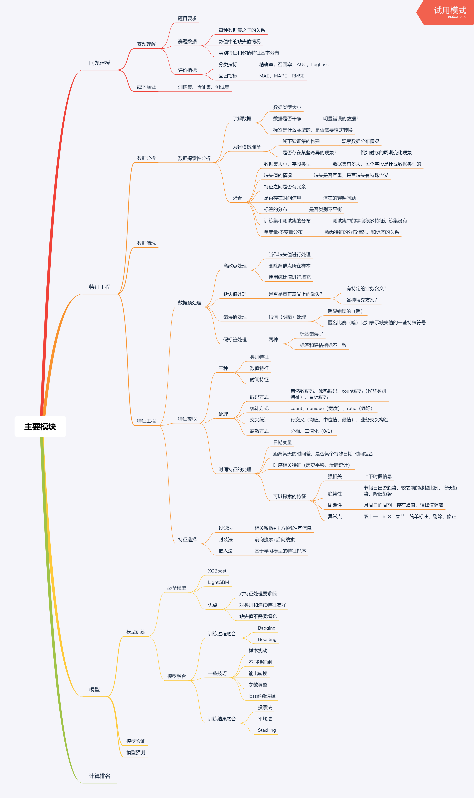

## 2.2 知乎工程师在知乎live中的经验分享
>🔗分享来自 @知乎live-知乎杯(https://www.zhihu.com/lives/1175441228609622016)

>### Some Notes  
**召回**：
1. 标签类：用户历史回答过的话题，关键词召回；基于用户关注、浏览等兴趣话题召回；基于内容分类召回
2. embedding类：创作话题、兴趣话题都有embedding，通过最近邻去召回相似的问题；通过深度学习模型去学习embedding召回
3. 其他的协同模型

>**特征提取:**
1. 问题侧特征：话题？
2. 比赛数据：
    - 选取一个月的邀请数据作为训练数据，选出后面一周的数据作为评测数据。对数据进行抽样，正样本保留，负样本采样一部分；这里的正样本，主要是指，用户在发出邀请7天内回答了问题的邀请（绝大多数都是在一天内回答的）
    - 数据集中涉及到的所有人的画像信息
    - 生产环境中真实用到的字、词、话题embedding
    - 数据集及历史回答中所有涉及到的问题信息
    - 数据集中所有人的回答记录
    - 划分训练验证集：避免特征穿越的问题--特征穿越：不要在训练中用到未来的特征（比如在预测用户1号回答情况时，不要用15号时统计学习到的特征！）
    - 出现新用户时或者从来没有回答过问题的用户时，多使用一些用户的兴趣特征；或者根据用户有回答过或者没回答过的情况，拆分成多个模型试试效果。
    - 出现新的问题：问题文本embedding，话题这些工作；
    - embedding的聚合方式，还是有很多的：
····· 对于传统的机器学习模型：比如average，max，mean等，用得比较多的是去average。用单字的embedding还是比较少的，用的分词的embedding比较多。比如对问题相关的topic取一个平均embedding，对用户的历史回答文本取平均或者加权平均的embedding，然后计算两个embedding之间的cosine相似度；
····· 对于深度学习模型：可以求个平均值聚合，或者直接concat起来
    - 对话题这种极其稀疏的特征，怎么处理：取交叉特征吧，比如问题的话题和用户的历史回答话题有没有重合，问题的话题和用户的兴趣话题有没有重合；但对于深度学习的模型，做一个onehot之类的处理后，还好，算不上稀疏问题；
    - 历史回答的文本embedding：可以按照用户维度进行聚合，挑选出用户最擅长的话题/词，然后求个average/sum pooling，或者求一个top3/5然后concat起来作为一个常向量；字的话效果可能不会很好。
    - gbdt不适合直接用embedding，可能更适合用通过embedding处理过的中间数据，比如连个embedding取之间的cosine相似度这样的交叉；
    - 如果线下效果比不上线上：检查一下训练过程中是否发生了特征穿越这样的现象；
    - 验证集划分：按时间维度去切分，会比随机去切更好一些；
    
    
    
# 3. 比赛分析
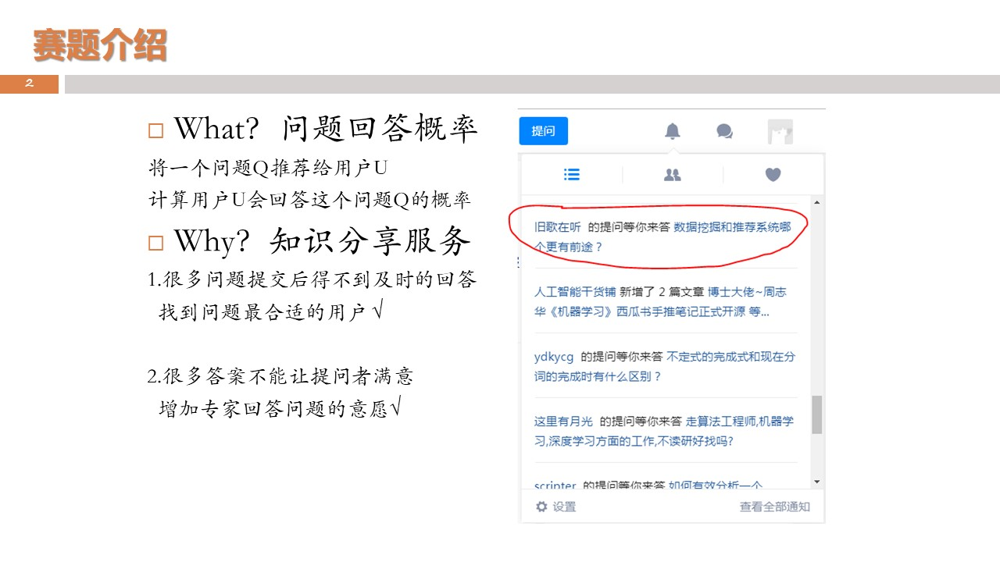
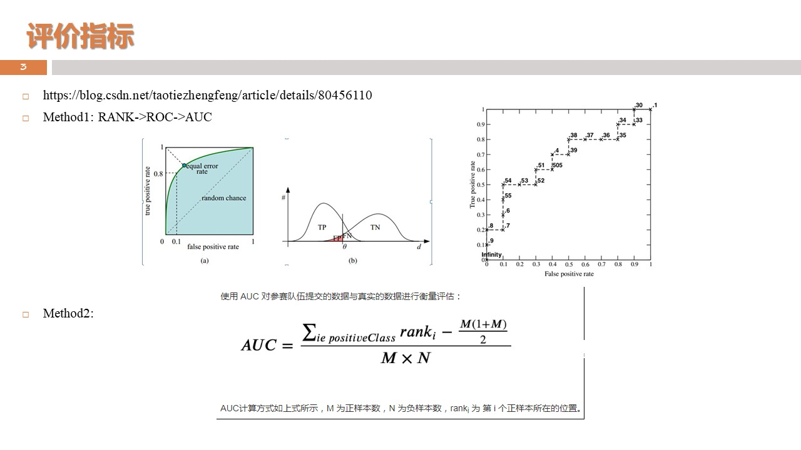
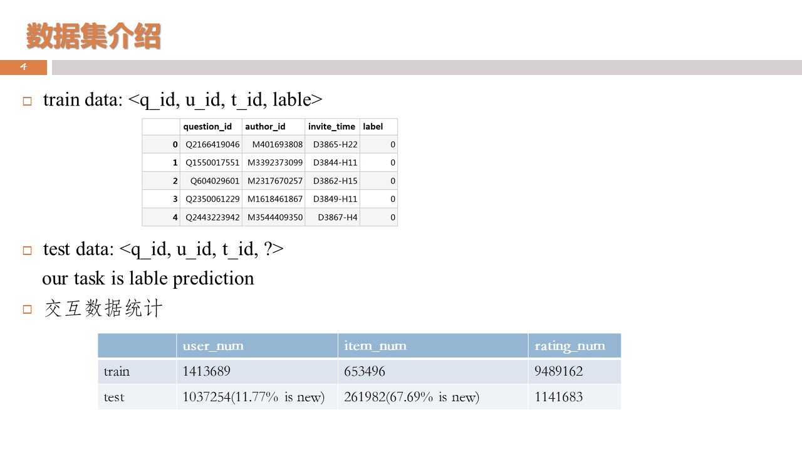

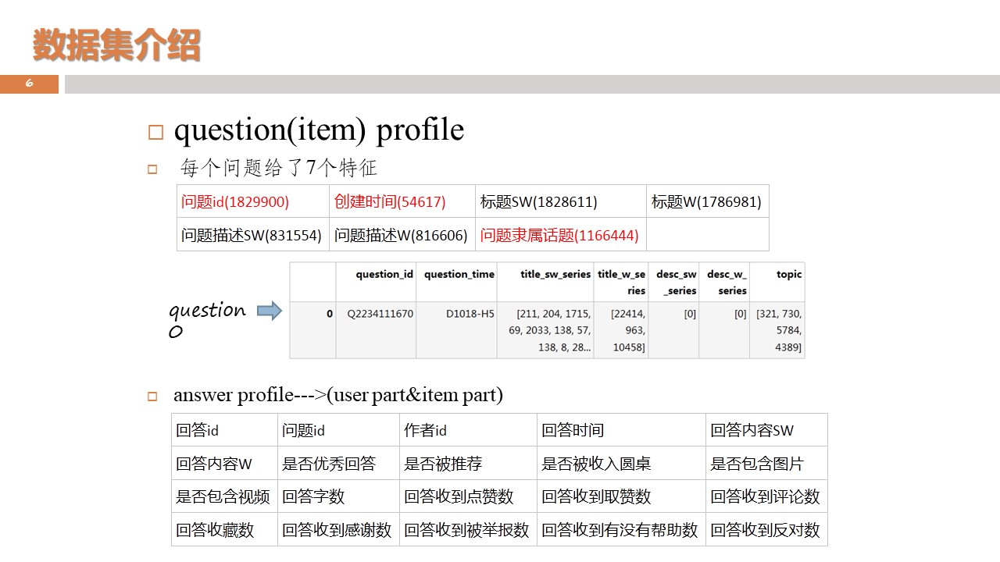
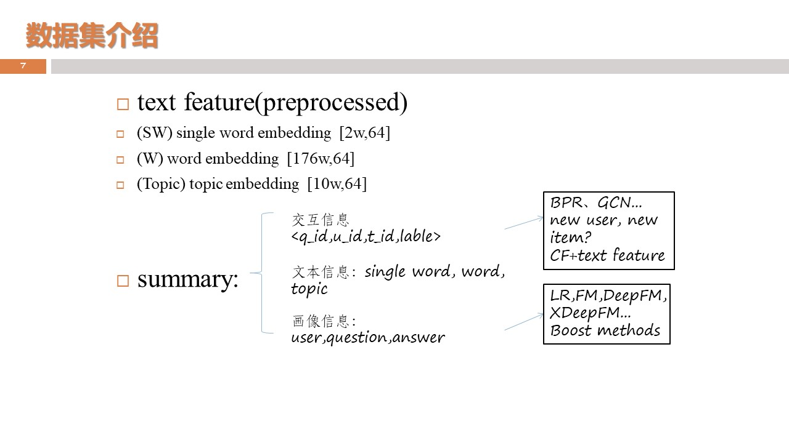
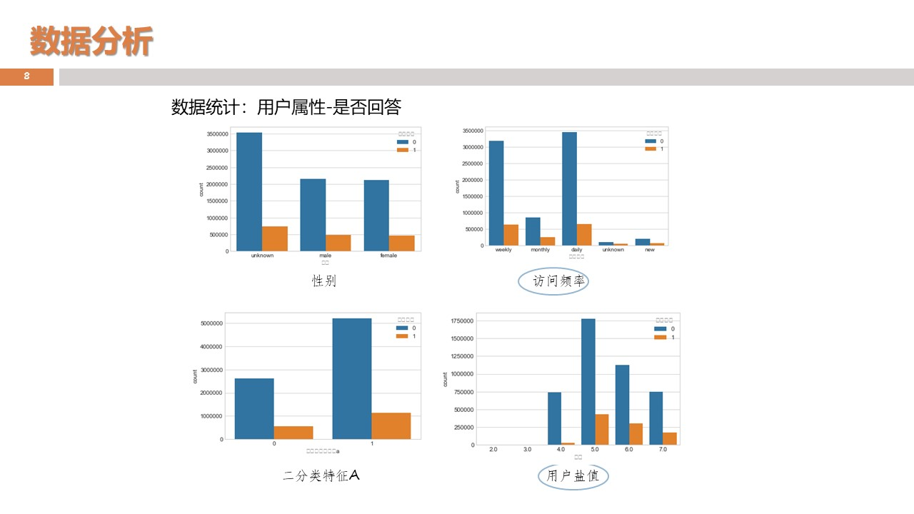
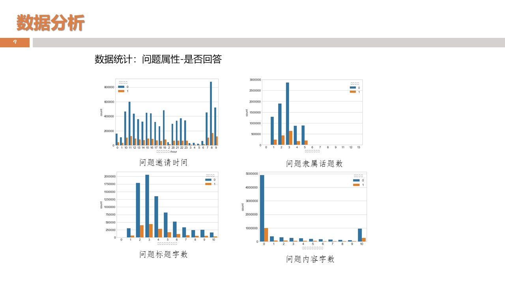
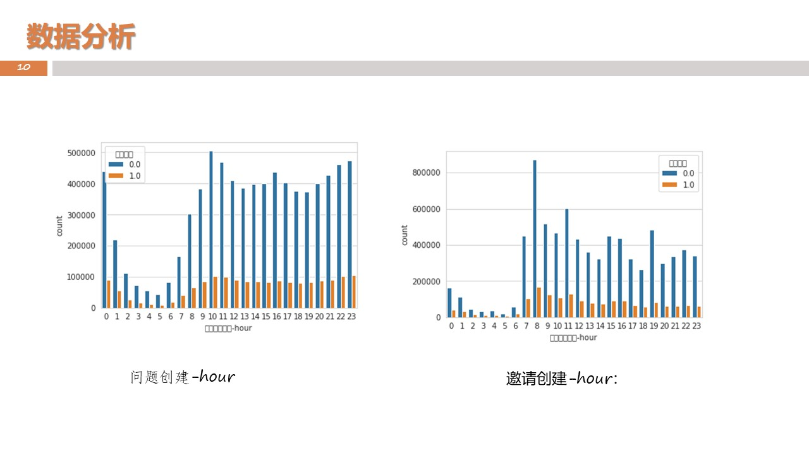
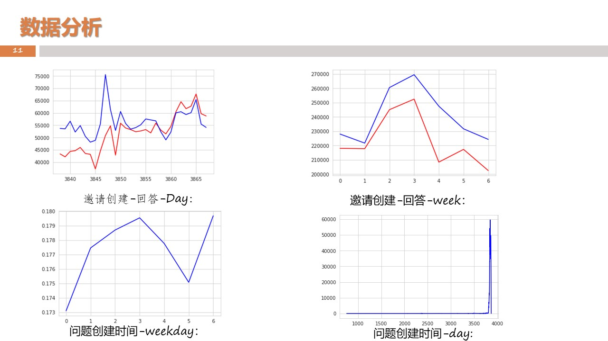
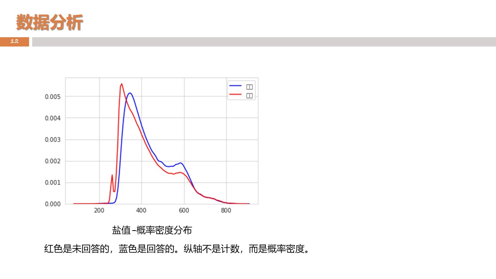
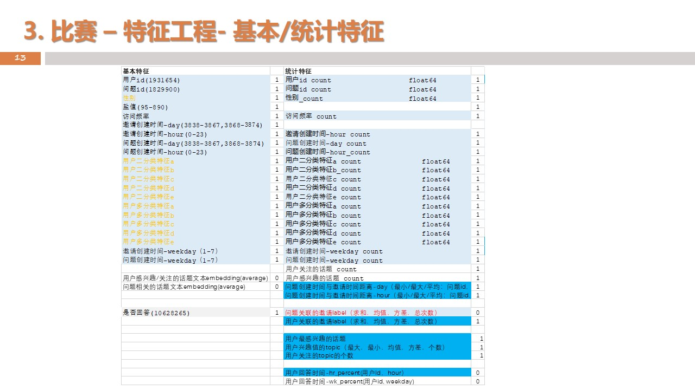
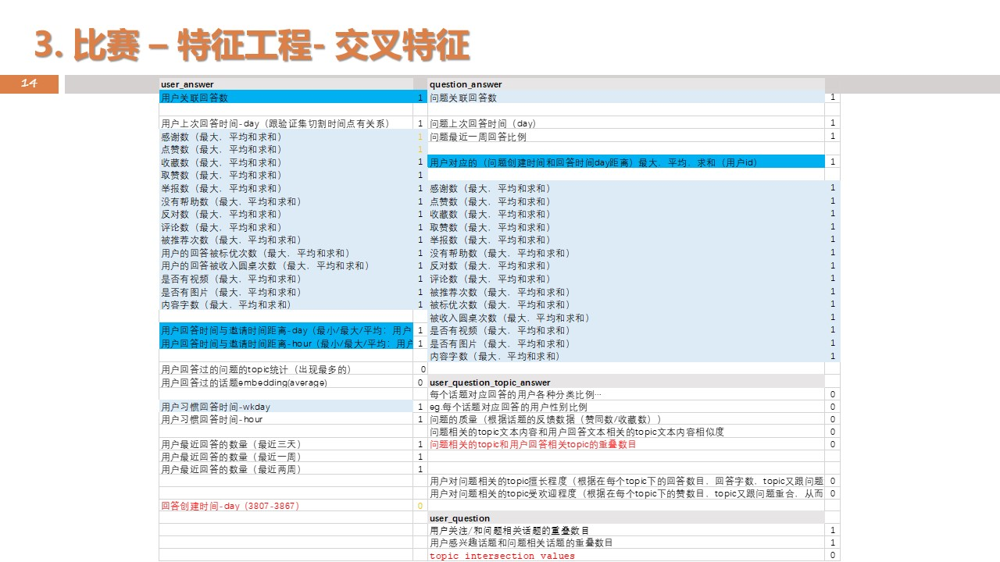
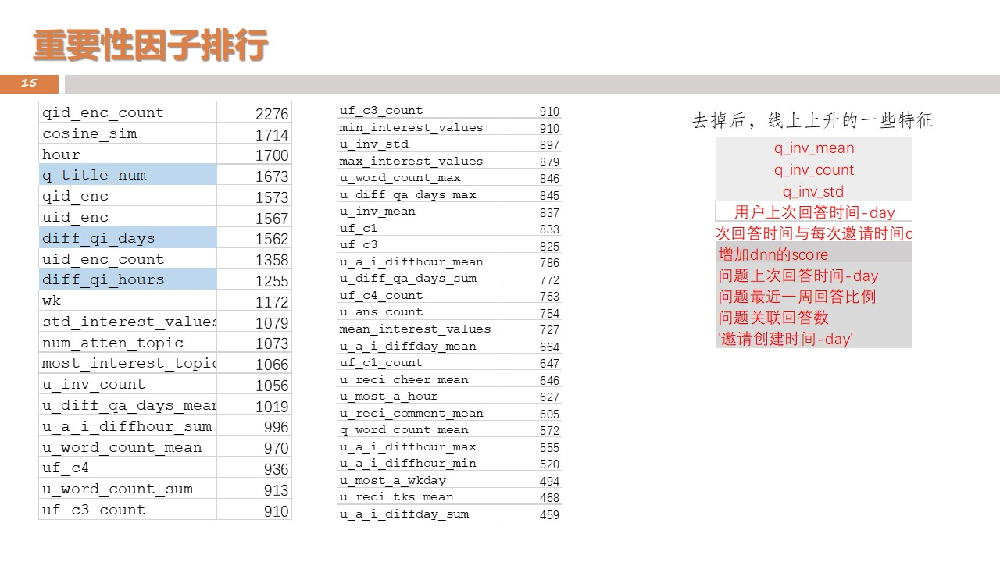
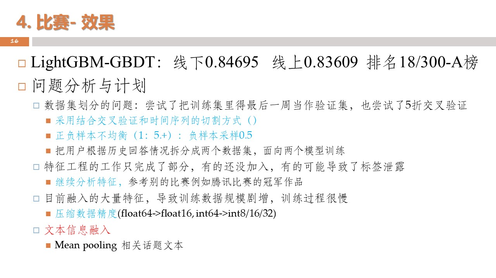

# 4. 比赛反思
- 没有及时采用最合适的baseline，一直在最开始的baseline上磨，效率比较低，应该及时切换到当前最合适的baseline上；
- 代码版本控制的经验不够，导致随着特征工作以及对照实验的增多，产生越来越多的冗余数据和冗余文件；
- 时间安排也不合适，最后没能把dnn训练res的融合思路做成功，大量的时间花在了修复冗余代码的工作上；
- 队伍分工不太明确，没能创建一个工作贴，把分工以及完成进度及时共享出来，提高合作效率；
- 对模型的理解还是不到位，一些loss的适用场景以及评价指标，还须及时复习；

# 5.代码分享
- 三个改进的baseline：（分别基于lightGBM,CatBoost, XGBoost实现的gbdt，基于开源deepFM和XdeepFM改进的dnn模型）  
- 一套原始的脱敏比赛数据
- 特征工程工作的记录(excel)